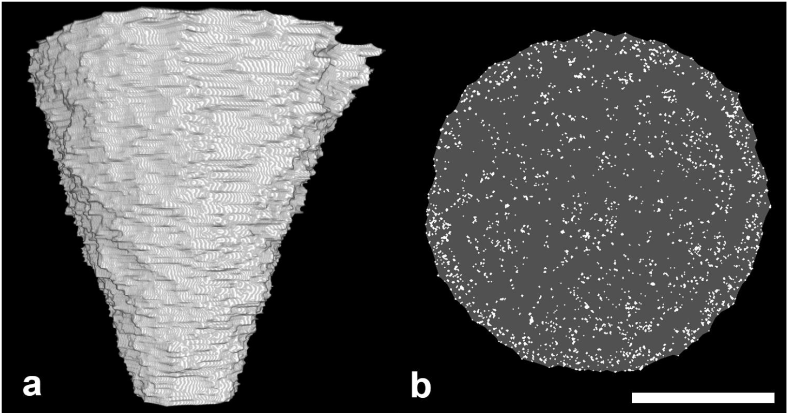

<!DOCTYPE html>
<html lang="en">
<head>
    <meta charset="UTF-8">
    <meta name="viewport" content="width=device-width, initial-scale=1.0">
    <title>Paper Display</title>
    
</head>
<body>

    <table>
        <tr>
            <td class="paper-image">
              <a href="https://arxiv.org/ftp/arxiv/papers/2110/2110.09017.pdf">
                
            </td>
            <td class="text">
                
Anatomy of a superorganism – structure and growth dynamics of
army ant bivouacs

                

                Thomas Bochynek, Florian Schiffers, Andre Aichert, Oliver Cossairt, Simon Garnier, Michael Rubenstein
                

                

                    ArXiv
                

                

                    <a href="2020_FS_CTM_Disassemblable_Fieldwork_CT_Scanner_Using_a_3D-printed_Calibration_Phantom.pdf">Paper</a>
                    <!-- <a href="supplement.pdf">Supplement</a> -->
                    <!-- <a href="#">Bibtex</a>
                    <a href="#">Code (soon)</a> -->
                

            </td>
        </tr>
    </table>

</body>
</html>
 

<figure>
  
</figure>

### Introduction
We explore the intricate world of army ant bivouacs using a custom-built Computed Tomography (CT) scanner. These self-assembling structures, formed by interconnected ants, have been challenging to study due to their delicate nature, but our innovative approach has allowed for detailed internal investigations.

### Method
#### CT Scanner & Experimentation
We developed a specialized CT scanner and installed it in Panama, where we collected Eciton burchellii army ant colonies. The scanner helped observe the self-assembly process of bivouacs, creating 3D reconstructions to study their growth in volume and the number of ants.

### Results and Discussion
Our findings reveal that bivouacs are complex structures with a dense outer shell and a less dense interior. The load supported by individual ants is consistent throughout the bivouac, suggesting that the bivouac's size is not limited by the individual ants' load-supporting capacity but by the number of available ants. The bivouacs maintain distinguishable morphological regions and achieve an equal distribution of carried loads, circumventing upper size limits.

### Conclusion
This study has provided unprecedented insights into the growth and internal structure of army ant bivouacs, offering valuable inspiration for designing large-scale artificial self-assembling systems in various fields. The findings suggest a remarkable level of organization and adaptability in these constantly reconfiguring structures.

<figure>
  
</figure>

<figure>
  
</figure>

<figure>
  
</figure>

<figure>
  
</figure>