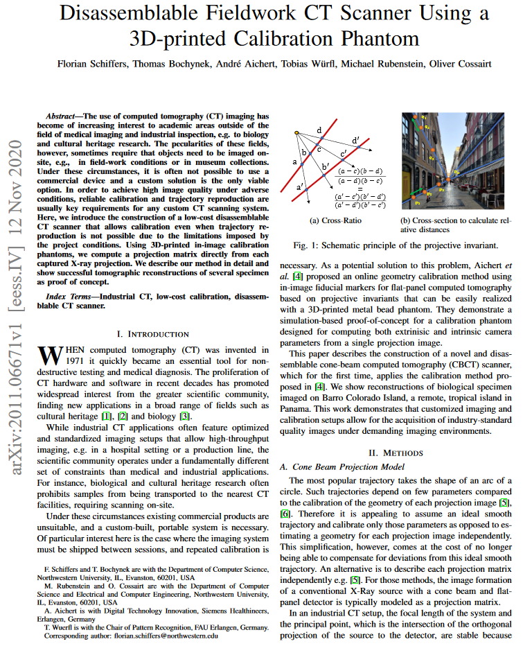
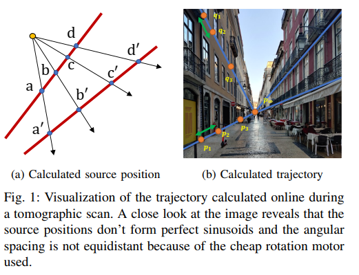
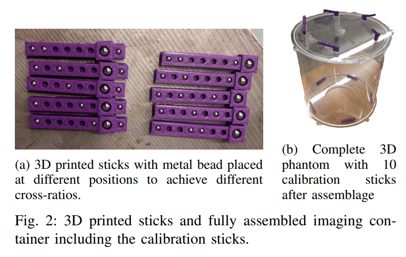
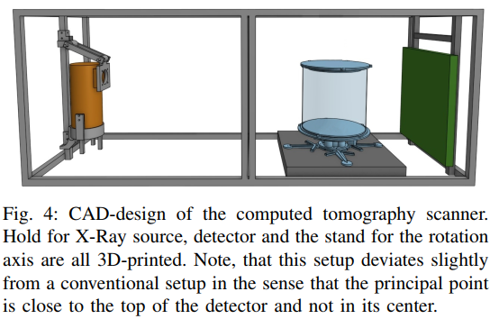
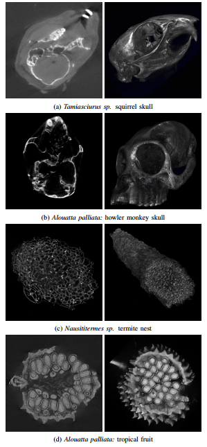
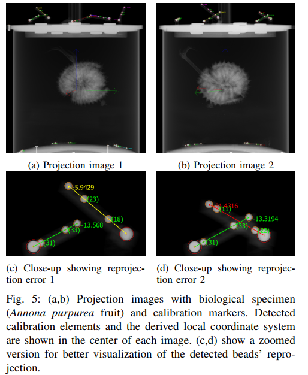

    Florian Schiffers, Thomas Bochynek, Andre Aichert, Tobias Würfl, Michael Rubenstein, Oliver Cossairt

<em>CT Meeting 2020</em>

<!DOCTYPE html>
<html lang="en">
<head>
    <meta charset="UTF-8">
    <meta name="viewport" content="width=device-width, initial-scale=1.0">
    <title>Paper Display</title>
    
</head>
<body>

### Introduction
In this study, we delve into the realm of computed tomography (CT) imaging, extending its application beyond medical imaging and industrial inspection to areas like biology and cultural heritage research. We present a low-cost, disassemblable CT scanner that can be calibrated even under challenging conditions where trajectory reproduction is not possible. This scanner is designed to be portable and adaptable, allowing imaging to be done on-site, which is crucial for instances where objects, such as biological samples or artifacts, cannot be transported to CT facilities.

### Method
#### Construction and Calibration
We constructed a novel and disassemblable cone-beam computed tomography (CBCT) scanner using 3D-printed in-image calibration phantoms. These phantoms allow us to compute a projection matrix directly from each captured X-ray projection, enabling high-quality image acquisition even under adverse conditions. The calibration phantoms consist of multiple short calibration elements, each with four uniquely spaced metal beads, allowing for robust reconstruction under demanding field conditions.

#### Phantom Design and Manufacture
We fabricated ten calibration elements, each containing a unique arrangement of four metal beads. These elements were 3D-printed from Polylactic acid, and metal ball bearings were press-fitted into predefined recesses. The arrangement of these elements ensured that at least three are fully visible on the detector for any projection image of the trajectory.

#### Experimental Setup
The CT scanner setup is composed of four main components: an imaging container with the calibration phantom, an X-Ray tube, a Digital X-Ray detector, and a rotation stage. The setup is shielded by fused lead/steel plates for radiation protection, and all components are controlled and synchronized via an Arduino Uno microprocessor.

### Results
We successfully demonstrated online-calibration with bead detection, feature matching using cross-ratios, and successful geometric calibration for different views. The complete trajectory was calibrated, and example tomographic reconstructions and renderings for four specimens found on-site at Barro Colorado Island were shown. The scanner was resilient to adverse conditions and was successfully operated for fieldwork in a tropical environment.

### Conclusion
We have successfully constructed a 3D CT scanner and online calibration phantom using commonly available materials and 3D printing. Despite the high-accuracy manufacturing requirements typically applied to medical devices, we obtained high-quality 3D reconstructions. Our setup is disassemblable for transport to remote locations and has proven to be a viable solution for on-site imaging under challenging conditions. This work can serve as a guideline for interested parties to develop their own applications, and future research directions include reducing the amount of detector space required for online calibration and employing additional artifact reduction techniques.

Feel free to ask if you need more details or clarifications on any specific part of the study!

    <table>
        <tr>
            <td class="paper-image">
              <a href="paper.pdf">
                
            </td>
            <td class="text">
                
Disassemblable Fieldwork CT Scanner Using a 3D-printed Calibration Phantom
MRI

                

                Florian Schiffers, Thomas Bochynek, Andre Aichert, Tobias Würfl, Michael Rubenstein, Oliver Cossairt
                

                

                    CT Meeting 2020
                

                

                    <a href="2020_FS_CTM_Disassemblable_Fieldwork_CT_Scanner_Using_a_3D-printed_Calibration_Phantom.pdf">Paper</a>
                    <!-- <a href="supplement.pdf">Supplement</a> -->
                    <!-- <a href="#">Bibtex</a>
                    <a href="#">Code (soon)</a> -->
                

            </td>
        </tr>
    </table>

</body>
</html>
 

<figure>
  
</figure>

<figure>
  
</figure>

<figure>
  
</figure>

<figure>
  
</figure>

<figure>
  
</figure>