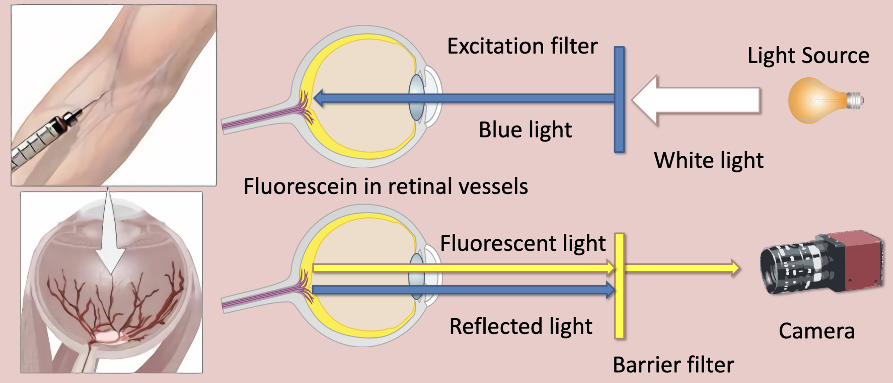
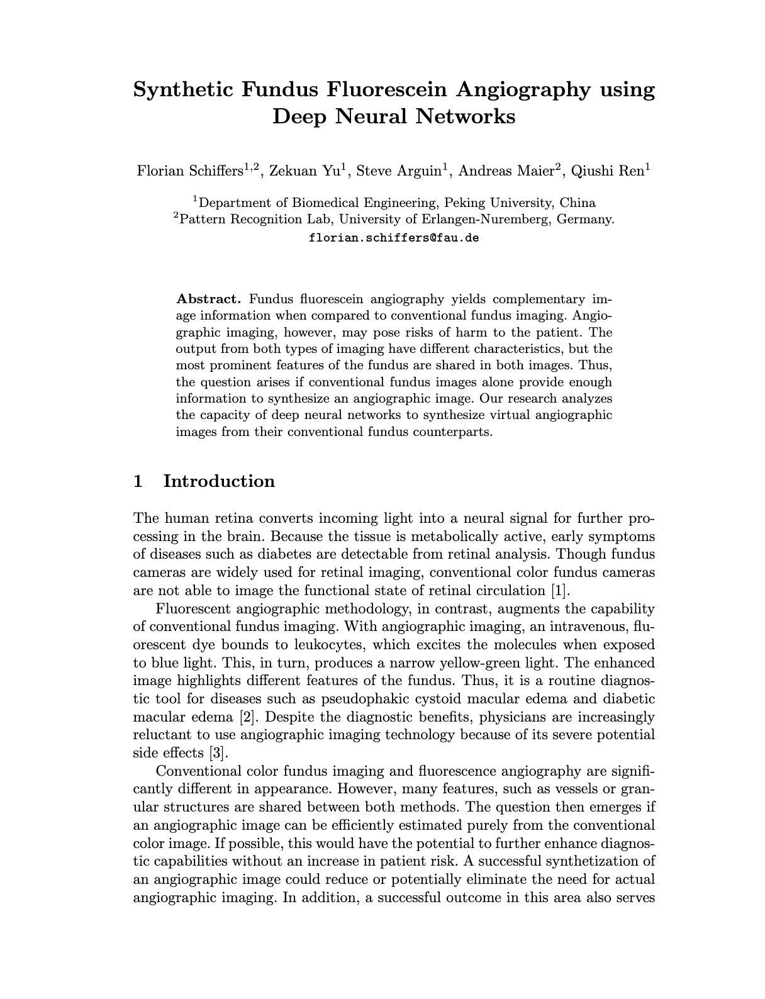
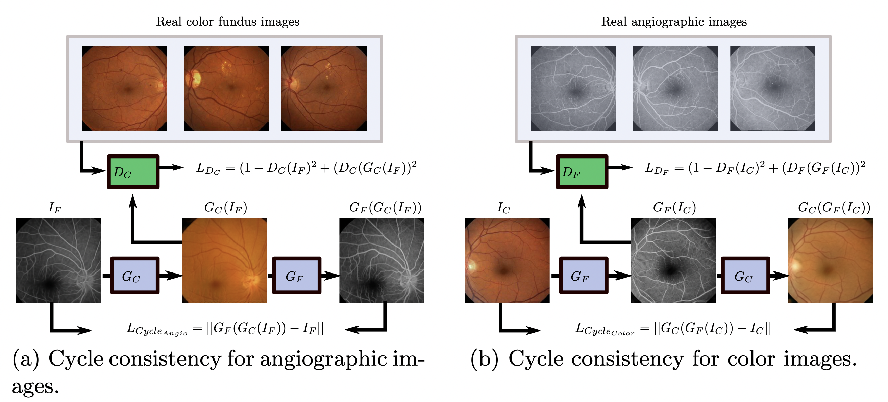

Florian Schiffers, Zekuan Yu, Steve Arguin, Andreas Maier, Qiushi Ren

<em>BVM 2018</em>

<figure>
  
  <figcaption>
    
    <strong>Fig. 1:</strong> An intravenous, fluorescent dye bounds to leukocytes, which excites the molecules when exposed to blue light. This, in turn, produces a narrow yellow-green light. The enhanced image highlights different features of the fundus.
    
  </figcaption>
</figure>

**Abstract:** Fundus fluorescein angiography yields complementary image information when compared to conventional fundus imaging. Angiographic imaging, however, may pose risks of harm to the patient. The output from both types of imaging have different characteristics, but the most prominent features of the fundus are shared in both images. Thus, the question arises if conventional fundus images alone provide enough information to synthesize an angiographic image. Our research analyzes the capacity of deep neural networks to synthesize virtual angiographic images from their conventional fundus counterparts.

<!DOCTYPE html>
<html lang="en">
<head>
    <meta charset="UTF-8">
    <meta name="viewport" content="width=device-width, initial-scale=1.0">
    <title>Paper Display</title>
    
</head>
<body>

    <table>
        <tr>
            <td class="paper-image">
              <a href="destination_url_here">
                
            </td>
            <td class="text">
                
Synthetic fundus fluorescein angiography using deep neural networks

                

                    Florian Schiffers, Zekuan Yu, Steve Arguin, Andreas Maier, Qiushi Ren
                

                

                    BVM 2018
                

                

                    <a href="paper.pdf">Paper</a>
                    <!-- <a href="#">Bibtex</a>
                    <a href="#">Code (soon)</a> -->
                

            </td>
        </tr>
    </table>

</body>
</html>

<figure>
  
  <figcaption>
    
    <strong>Fig. 2:</strong> The two figures visualize the composition of the loss term used for the training process of the cycleGAN architecture. <em>IF</em> and <em>IC</em> are the input images for the color fundus image generator <em>GC</em> and the angiographic image generator <em>GF</em>, respectively. Similarly, <em>DC</em> and <em>DF</em> denote the respective discriminator networks. Cycle consistency is enforced so that the backwards translation resembles the input image for both ways, see <em>LCycle_Angio</em> and <em>LCycle_Color</em>. The adversarial loss, i.e. the capacity of the network to distinguish between real and fake images, is modeled by <em>LDC</em> and <em>LDF</em>.
    
  </figcaption>
</figure>

<figure>
  
  <figcaption>
    
     <strong>Fig. 3:</strong> Each row shows from left to right the real and generated angiographic image, the authentic color image, and the reconstructed color image to show cycle consistency. The first three rows are from dataset [10], the remaining is taken from our own data.
    
  </figcaption>
</figure>

### Introduction:
We delve into synthesizing angiographic images from conventional color fundus images using deep neural networks, aiming to provide safer diagnostic alternatives due to the potential risks associated with angiographic imaging.

### Method:
#### CycleGAN Approach:
Utilizing CycleGAN, we translate between conventional and angiographic fundus images. This model comprises generators and discriminators, trained to create images that are nearly indistinguishable from real ones. The images were preprocessed and augmented to enhance the dataset size, and the network underwent training with a learning rate that decreased over epochs.

### Results:
The synthesized images closely resembled the real angiographic images, enhancing certain structures like vessels. However, there were variations in brightness and contrast, and some small details were not accurately synthesized.

### Discussion & Future Work:
This study demonstrates the potential of using synthetic angiographic images for developing robust algorithms, but the practical utility for medical practitioners needs further exploration. Future research will focus on refining image resolution and exploring advanced data-augmentation methods.

<object data="poster.pdf" type="application/pdf" width="900px" height="1200px">
    <embed src="poster.pdf">
        
This browser does not support PDFs. Please download the PDF to view it: <a href="poster.pdf">Download PDF</a>.

    </embed>
</object>