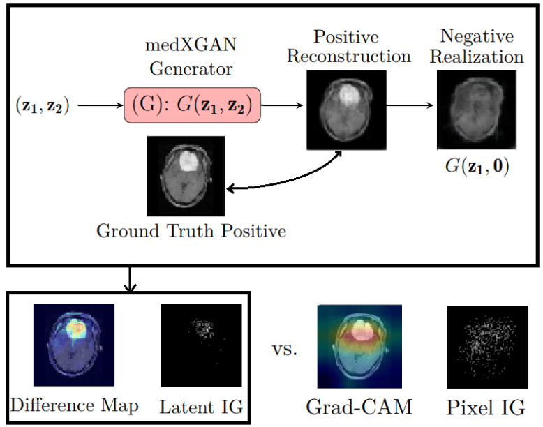
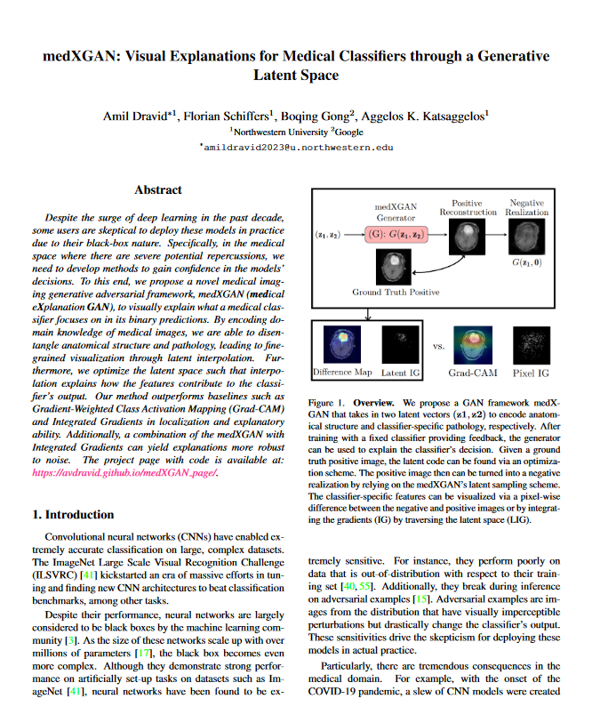

Amil Dravid, Florian Schiffers, Boqing Gong, Aggelos K. Katsaggelos

<em>CVPR Workshops 2022</em>

<figure>
  
  <figcaption>
    
<strong>Figure 1. Overview.</strong> We propose a GAN framework medX-GAN that takes in two latent vectors (z1, z2) to encode anatomical structure and classifier-specific pathology, respectively. After training with a fixed classifier providing feedback, the generator can be used to explain the classifier’s decision. Given a ground truth positive image, the latent code can be found via an optimization scheme. The positive image then can be turned into a negative realization by relying on the medXGAN’s latent sampling scheme. The classifier-specific features can be visualized via a pixel-wise difference between the negative and positive images or by integrating the gradients (IG) by traversing the latent space (LIG).
    
  </figcaption>
</figure>

**Abstract:** Despite the surge of deep learning in the past decade, some users are skeptical to deploy these models in practice due to their black-box nature. Specifically, in the medical space where there are severe potential repercussions, we need to develop methods to gain confidence in the models' decisions. To this end, we propose a novel medical imaging generative adversarial framework, medXGAN (medical eXplanation GAN), to visually explain what a medical classifier focuses on in its binary predictions. By encoding domain knowledge of medical images, we are able to disentangle anatomical structure and pathology, leading to fine-grained visualization through latent interpolation. Furthermore, we optimize the latent space such that interpolation explains how the features contribute to the classifier's output. Our method outperforms baselines such as Gradient-Weighted Class Activation Mapping (Grad-CAM) and Integrated Gradients in localization and explanatory ability. Additionally, a combination of the medXGAN with Integrated Gradients can yield explanations more robust to noise. The project page with code is available at: https://avdravid.github.io/medXGAN page.

<!DOCTYPE html>
<html lang="en">
<head>
    <meta charset="UTF-8">
    <meta name="viewport" content="width=device-width, initial-scale=1.0">
    <title>Paper Display</title>
    
</head>
<body>

    <table>
        <tr>
            <td class="paper-image">
              <a href="destination_url_here">
                
            </td>
            <td class="text">
                
medXGAN - Visual Explanations for Medical Classifiers Through a Generative Latent Space

                

                    Amil Dravid, Florian Schiffers, Boqing Gong, Aggelos K. Katsaggelos
                

                

                    CVPR Workshops 2024
                

                

                    <a href="paper.pdf">Paper</a>
                    <!-- <a href="#">Bibtex</a>
                    <a href="#">Code (soon)</a> -->
                

            </td>
        </tr>
    </table>

</body>
</html>

<!-- 

    <figure>
        <figcaption><strong>Figure 2. medXGAN training scheme.</strong> A pretrained classifier provides class feedback to the generator’s synthesized image while the discriminator and generator play their typical adversarial game. The latent vector consists of z1 which encodes anatomical structure and z2 which corresponds to a continuous class code for pathology features according to the classifier.</figcaption>
    </figure>

    <figure>
        <figcaption><strong>Figure 3. Example of disentangled lungs and classifier features.</strong> The classifier’s softmax outputs are above along with label provided to generator. We can see that the lung and skeletal structure is intact, but features within the anatomy change, leading to different classifier outputs. The largest changes are highlighted by an arrow.</figcaption>
    </figure>

    <figure>
        <figcaption><strong>Figure 4. Reconstructing a COVID positive image and turning it negative.</strong> Given a real positive class image, the latent code (z1, z2) can be found via SGD with the generator to match pixel-wise and through the classifier’s output. The positive reconstruction can be turned into a negative realization by setting z2 = 0. The classifier softmax outputs are below the respective images. Here, we visualize the pixel-wise difference between the realizations. Compared to Grad-CAM, we see more localization ability.</figcaption>
    </figure>

    <figure>
        <figcaption><strong>Figure 5. Example of latent interpolation.</strong> Because z1 and z2 are disentangled latent codes, we can traverse the latent space by fixing z1 and stepping through z2. We observe fixed anatomical structure and changing pathology according to the classifier. The classifier’s softmax outputs shown above each respective image. Additionally, we visualize the accumulating absolute value pixel-wise difference through the interpolation, which illustrates how the changing features contribute to the classifier’s output.</figcaption>
    </figure> -->

<figure>
  
  <figcaption>
    
    <strong>Fig. 2:</strong> The two figures visualize the composition of the loss term used for the training process of the cycleGAN architecture. <em>IF</em> and <em>IC</em> are the input images for the color fundus image generator <em>GC</em> and the angiographic image generator <em>GF</em>, respectively. Similarly, <em>DC</em> and <em>DF</em> denote the respective discriminator networks. Cycle consistency is enforced so that the backwards translation resembles the input image for both ways, see <em>LCycle_Angio</em> and <em>LCycle_Color</em>. The adversarial loss, i.e. the capacity of the network to distinguish between real and fake images, is modeled by <em>LDC</em> and <em>LDF</em>.
    
  </figcaption>
</figure>

<figure>
  
  <figcaption>
    
     <strong>Fig. 3:</strong> Each row shows from left to right the real and generated angiographic image, the authentic color image, and the reconstructed color image to show cycle consistency. The first three rows are from dataset [10], the remaining is taken from our own data.
    
  </figcaption>
</figure>

### Introduction:
We delve into synthesizing angiographic images from conventional color fundus images using deep neural networks, aiming to provide safer diagnostic alternatives due to the potential risks associated with angiographic imaging.

### Method:
#### CycleGAN Approach:
Utilizing CycleGAN, we translate between conventional and angiographic fundus images. This model comprises generators and discriminators, trained to create images that are nearly indistinguishable from real ones. The images were preprocessed and augmented to enhance the dataset size, and the network underwent training with a learning rate that decreased over epochs.

### Results:
The synthesized images closely resembled the real angiographic images, enhancing certain structures like vessels. However, there were variations in brightness and contrast, and some small details were not accurately synthesized.

### Discussion & Future Work:
This study demonstrates the potential of using synthetic angiographic images for developing robust algorithms, but the practical utility for medical practitioners needs further exploration. Future research will focus on refining image resolution and exploring advanced data-augmentation methods.

<object data="poster.pdf" type="application/pdf" width="900px" height="1200px">
    <embed src="poster.pdf">
        
This browser does not support PDFs. Please download the PDF to view it: <a href="poster.pdf">Download PDF</a>.

    </embed>
</object>