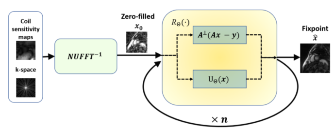
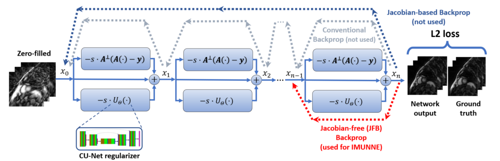
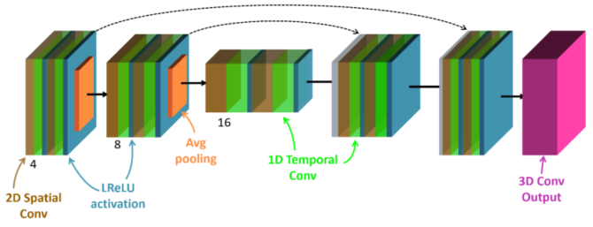
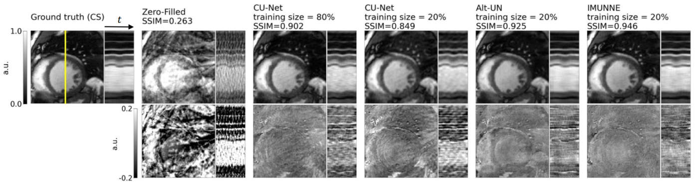
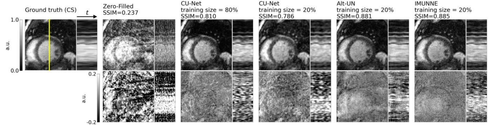

Nikolay Iakovlev, Florian A Schiffers, Santiago L Tapia, Daming Shen, KyungPyo Hong, Michael Markl, Daniel C Lee, Aggelos K Katsaggelos, Daniel Kim

<em>IEEE Trans Biomed Eng</em>

<!DOCTYPE html>
<html lang="en">
<head>
    <meta charset="UTF-8">
    <meta name="viewport" content="width=device-width, initial-scale=1.0">
    <title>Paper Display</title>
    
</head>
<body>

<strong>Abstract:</strong> This work addresses the challenge of reconstructing highly-undersampled, dynamic MRI, particularly in multi-coil scenarios, which is a difficult inverse problem. While unrolled networks offer state-of-the-art performance, they are limited by long training times and high GPU memory requirements. We introduce a novel training strategy for IMplicit UNrolled NEtworks (IMUNNE) specifically designed for highly-undersampled, multi-coil dynamic MRI reconstruction. IMUNNE formulates the reconstruction as an implicit fixed-point equation and uses gradient approximation for backpropagation, which enables the training of deep architectures with fixed memory costs. This approach marks the first application of implicit network theory in real-time cine MRI. We evaluated IMUNNE using a prospectively undersampled, real-time cine dataset with radial k-space sampling and conducted a comprehensive analysis including hyperparameter optimization, comparisons with a complex U-Net (CU-Net) and an alternating unrolled network (Alt-UN), and robustness under noise perturbations. The results demonstrate that IMUNNE delivers superior image quality compared to CU-Net and Alt-UN, while also significantly reducing training and inference times, positioning it as a promising solution for accelerated, multi-coil real-time cine MRI reconstruction. This strategy effectively applies unrolled networks to the reconstruction of highly-accelerated, real-time radial cine MRI, offering a rapid, high-quality, and cost-effective approach to CMR exams.

    <table>
        <tr>
            <td class="paper-image">
              <a href="paper.pdf">
                
            </td>
            <td class="text">
                
Computationally Efficient IMplicit Training Strategy for UNrolled NEtworks (IMUNNE): A preliminary analysis using accelerated real-time cardiac cine MRI 

                

                Nikolay Iakovlev, Florian A Schiffers, Santiago L Tapia, Daming Shen, KyungPyo Hong, Michael Markl, Daniel C Lee, Aggelos K Katsaggelos, Daniel Kim
                

                

                    IEEE Trans Biomed Eng 2024
                

                

                    <a href="paper.pdf">Paper</a>
                    <!-- <a href="supplement.pdf">Supplement</a> -->
                    <!-- <a href="#">Bibtex</a>
                    <a href="#">Code (soon)</a> -->
                

            </td>
        </tr>
    </table>

</body>
</html>
 

<figure>
  
  <figcaption>
    

<strong>Fig. 1.</strong> Schematic illustration of the unrolled structure interpreted as an implicit network: Zero-filled input x0, which was obtained by the inverse NUFFT operator, is refined by the update R&Theta; until convergence. R&Theta; consists of a data-consistency term and learned regularizer.

    
  </figcaption>
</figure>

<figure>
  
  <figcaption>
    

<strong>Fig. 2.</strong> Unrolled architecture defined by the update operator R&Theta;,t: n identical unrolled blocks consisting of data consistency (top), skip connection (center), and a learned regularizer term (bottom). Zero-filled initial estimate x0 is refined consecutively by each block. For the sake of brevity, the figure does not show the measured k-space and the coil-sensitivity maps which are part of the input for the data consistency blocks. The last block produces the final image xn. End-to-end training can be achieved by either conventional or Jacobian-based, i.e. analytical, backpropagation. In contrast to end-to-end training, IMUNNE interprets the unrolled scheme as an implicit network and applies Jacobian-free backpropagation [33], i.e., error is propagated only through the last block, thereby approximating the true gradient. Due to weight sharing, this is sufficient to update all regularizers. In our experiments, we use a complex U-Net to implement the learned regularizer U&Theta;.

    
  </figcaption>
</figure>

<figure>
  
  <figcaption>
    

<strong>Fig. 3.</strong> Complex U-Net (CU-Net) architecture: encoding/decoding stages enhanced with skip connections (dashed line). Each stage consists of 2D spatial followed by 1D temporal convolutional layers (cf. [30]). We use leaky ReLU as activation function and average pooling. The final 3D convolution layer produces the final output. We employed CU-Net both as IMUNNE regularizer (U&Theta;) and as a standalone denoiser network with the same number of parameters.

    
  </figcaption>
</figure>

<figure>
  
  <figcaption>
    

<strong>Fig. 5.</strong> Representative example from b-SSFP testing dataset. The upper row depicts the 15th frame along with the temporal profile along the vertical middle line (e.g., like M-mode in echocardiography; yellow line in the left image) of the cine series reconstructed with (from left to right): Compressed Sensing (ground truth image); inverse NUFFT of the undersampled k-space; CU-Net trained on 80% of the data; CU-Net; Alt-UN; IMUNNE. The bottom row shows the corresponding scaled difference images for each method. For dynamic display, see Video S1 in Supplemental Materials.

    
  </figcaption>
</figure>

<figure>
  
  <figcaption>
    

<strong>Fig. 6.</strong> Same representative example from b-SSFP testing dataset with noise-corrupted k-space as input. The upper row depicts the 15th frame along with the temporal profile along the vertical middle line (e.g., like M-mode in echocardiography; yellow line in the left image) of the cine series reconstructed with (from left to right): Compressed Sensing (ground truth image); inverse NUFFT of the undersampled k-space; CU-Net trained on 80% of the data; CU-Net; Alt-UN; IMUNNE. The bottom row shows the corresponding scaled difference images for each method. For dynamic display, see Video S2 in Supplemental Materials.

    
  </figcaption>
</figure>