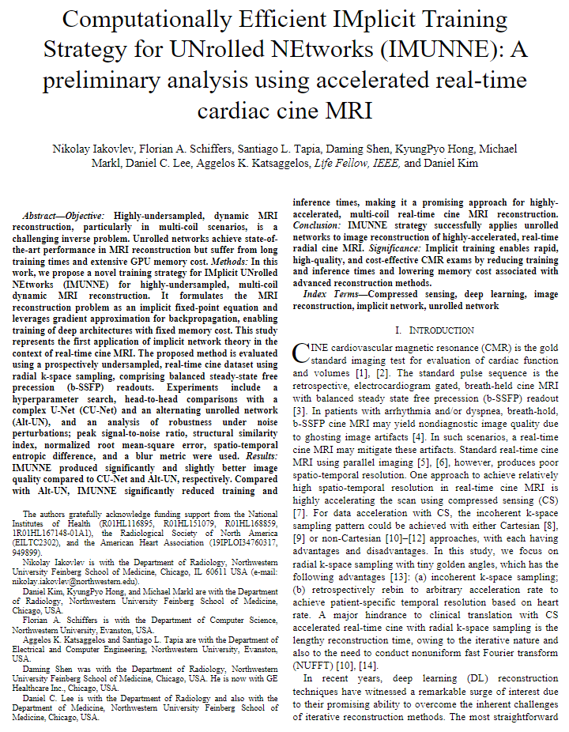

   Hui Lin, Santiago López-Tapia,Florian Schiffers, Yunan Wu, Suvai Gunasekaran, Julia Hwang, Dima Bishara, Eugene Kholmovski, Mohammed Elbaz, Rod S. Passman, Daniel Kim, and Aggelos K. Katsaggelos

<em>Heliyon 2024</em>

<!DOCTYPE html>
<html lang="en">
<head>
    <meta charset="UTF-8">
    <meta name="viewport" content="width=device-width, initial-scale=1.0">
    <title>Paper Display</title>
    
</head>
<body>

    <table>
        <tr>
            <td class="paper-image">
              <a href="paper.pdf">
                
            </td>
            <td class="text">
                
Multisource Holography

                

                    Grace Kuo, Florian Schiffers, Douglas Lanman, Oliver Cossairt, Nathan Matsuda
                

                

                    ICCP 2023
                

                

                    <a href="paper.pdf">Paper</a>
                    <a href="supplement.pdf">Supplement</a>
                    <!-- <a href="#">Bibtex</a>
                    <a href="#">Code (soon)</a> -->
                

            </td>
        </tr>
    </table>

</body>
</html>
 
