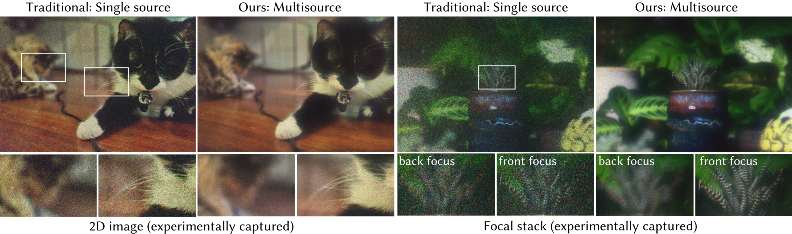
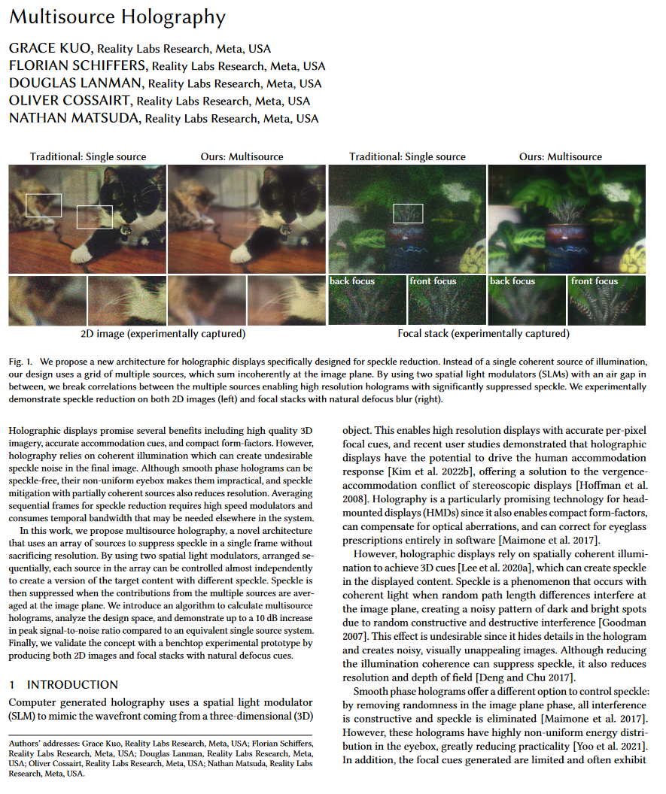
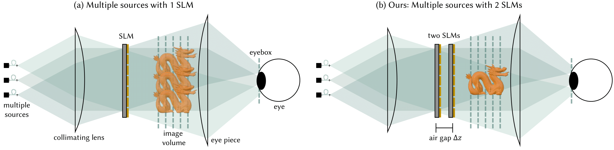
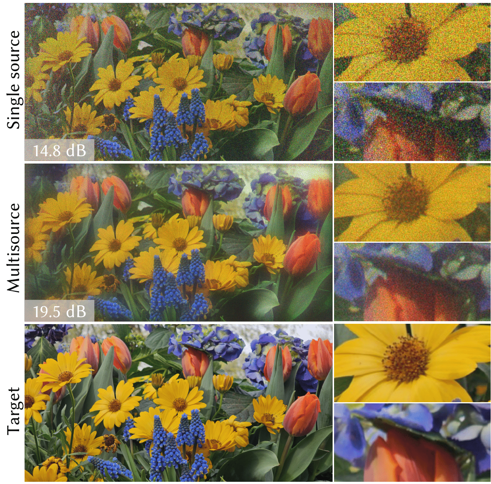
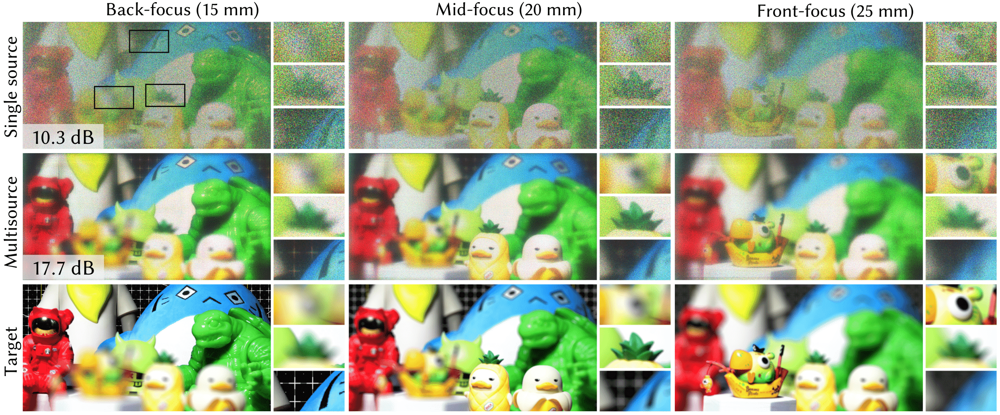

   Grace Kuo, Florian Schiffers, Douglas Lanman, Oliver Cossairt, Nathan Matsuda

<em>Siggraph Asia 2023</em>

<iframe width="950" height="615" src="https://www.youtube.com/embed/aPezu0YAoy4" frameborder="0" allowfullscreen></iframe>

<figure>
  
  <figcaption>
    
      <strong>Figure 1:</strong> We propose a new architecture for holographic displays specifically designed for speckle reduction. Instead of a single coherent source of illumination, our design uses a grid of multiple sources, which sum incoherently at the image plane. By using two spatial light modulators (SLMs) with an air gap in between, we break correlations between the multiple sources enabling high-resolution holograms with significantly suppressed speckle. We experimentally demonstrate speckle reduction on both 2D images (left) and focal stacks with natural defocus blur (right).
    
  </figcaption>
</figure>

<!DOCTYPE html>
<html lang="en">
<head>
    <meta charset="UTF-8">
    <meta name="viewport" content="width=device-width, initial-scale=1.0">
    <title>Paper Display</title>
    
</head>
<body>

    <table>
        <tr>
            <td class="paper-image">
              <a href="paper.pdf">
                
            </td>
            <td class="text">
                
Multisource Holography

                

                    Grace Kuo, Florian Schiffers, Douglas Lanman, Oliver Cossairt, Nathan Matsuda
                

                

                    ICCP 2023
                

                

                    <a href="paper.pdf">Paper</a>
                    <a href="supplement.pdf">Supplement</a>
                    <!-- <a href="#">Bibtex</a>
                    <a href="#">Code (soon)</a> -->
                

            </td>
        </tr>
    </table>

</body>
</html>
 

In one my favorite research projects that I have worked on, we propose a novel architecture for holographic displays called multisource holography, designed specifically to reduce speckle noise while maintaining high resolution and natural defocus cues. Traditional holographic displays rely on coherent illumination, which can create undesirable speckle patterns in the final image. Existing speckle reduction techniques often sacrifice resolution or require high-speed modulators and temporal multiplexing.

Multisource holography addresses these challenges by replacing the single coherent light source with a grid of multiple mutually incoherent sources. By using two spatial light modulators (SLMs) with a small air gap between them, the system breaks correlations between the sources, enabling each source to independently contribute to the final hologram. The intensities from the multiple sources sum incoherently at the image plane, effectively suppressing speckle through averaging.

We demonstrate the effectiveness of this approach through both simulations and a benchtop experimental prototype. In simulations, multisource holography achieves up to a 10 dB increase in peak signal-to-noise ratio compared to an equivalent single source system. The experimental results showcase low speckle holograms for both 2D images and focal stacks with natural defocus blur. We also introduce a customized calibration procedure to account for non-idealities in the optical system.

Multisource holography represents a significant step forward in the development of practical, high-quality holographic displays for virtual and augmented reality applications. By enabling speckle reduction in a single frame without sacrificing resolution or requiring high-speed modulators, this innovative approach paves the way for more realistic and visually appealing holographic experiences.

<figure>
  
  <figcaption>
    
      <strong>Figure 2:</strong>
<em>System Overview:</em>
    Multisource holography uses an array of mutually incoherent sources that each generate a plane wave at a different angle. (a) With a single SLM, all sources are modulated with the same pattern but propagate in different directions, creating replicas of the content. Generating an image with this configuration is a poorly posed problem. (b) We propose adding a second SLM a small distance in front of the first. This enables different modulation function for different angles of incidence, enabling unique content for each source. By jointly optimizing the two SLM patterns, the  holograms from each source line up correctly, removing replica artifacts. Since the sources are incoherent with each other, their intensities add at the image plane which suppresses speckle through averaging.
    
  </figcaption>
</figure>

<figure>
  
  <figcaption>
    
      <strong>Figure 3:</strong>
 <em>Single Source vs. Multisource (Simulation):</em>
    In simulation, we compare four methods for generating a target focal stack (a) with natural defocus cues. (b) A traditional single source hologram optimized with smooth phase has no speckle but there are ringing artifacts in the defocused regions. More importantly, the energy distribution in the eyebox (bottom row) is extremely non-uniform (note that plots are logarithmic) with a large peak in the center, which makes the display sensitive to eye imperfections and requires precise, low latency eye tracking and 3D pupil steering for a usable display. (c) A single source hologram with random phase achieves an approximately uniform eyebox distribution, but the image is corrupted by severe speckle. (d) Multiple sources reduce speckle, but with a single SLM, correlations between the outputs of each source create haze and doubling in the displayed hologram. (e) Our multisource holography approach uses two SLMs (here, one phase SLM and one amplitude SLM) to break correlations between the individual source outputs. This removes the low frequency artifacts in (d) while preserving the speckle reduction.  Although (e) uses two SLMs, all simulations have the same degrees of freedom since (b)-(d) are simulated with a single complex SLM. Out of these approaches, only multisource holography is capable of creating high quality focal stacks with a practical energy distribution in the eyebox. 
    
  </figcaption>
</figure>

<figure>
  
  <figcaption>
    
      <strong>Figure 4:</strong>
<em>2D Results (Experiment):</em> Although a single source random phase hologram can theoretically control speckle well for a 2D image, the experimental 2D capture (top) has visible speckle when one zooms in. Our multisource configuration with 4x4 sources (middle) has noticeably reduced speckle while maintaining high frequency features. PSNR is shown in the bottom left.
    
  </figcaption>
</figure>

<figure>
  
  <figcaption>
    
      <strong>Figure 5:</strong>
       <em>Focal Stack Results (Experiment)</em>:
       Focal stacks created by a single source hologram with random phase (top) suffer from severe speckle noise since there are insufficient degrees of freedom on the SLM to control speckle throughout a 3D volume. Our multisource approach with 4x4 sources (middle) greatly reduces speckle, enabling experimental focal stacks with natural defocus cues. PSNR calculated over the full focal stack is shown in the bottom left.
    
  </figcaption>
</figure>

