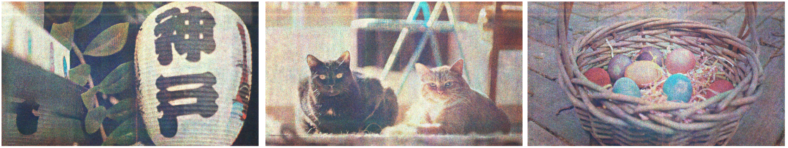
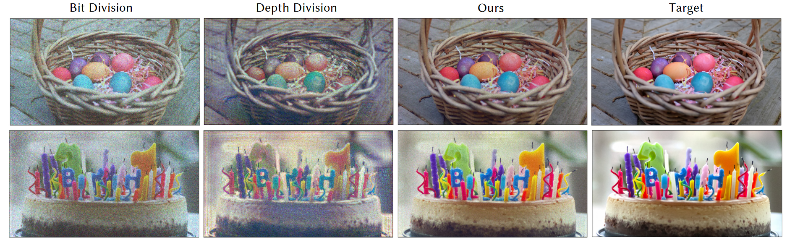
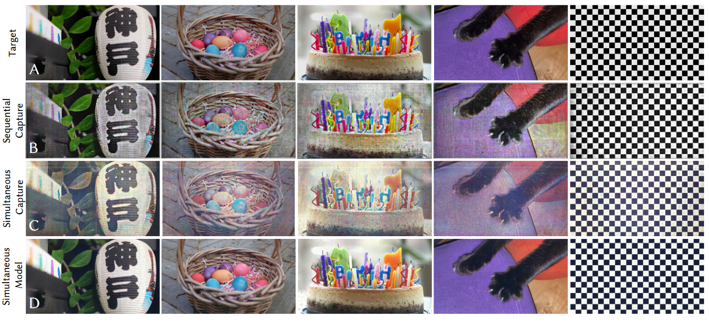
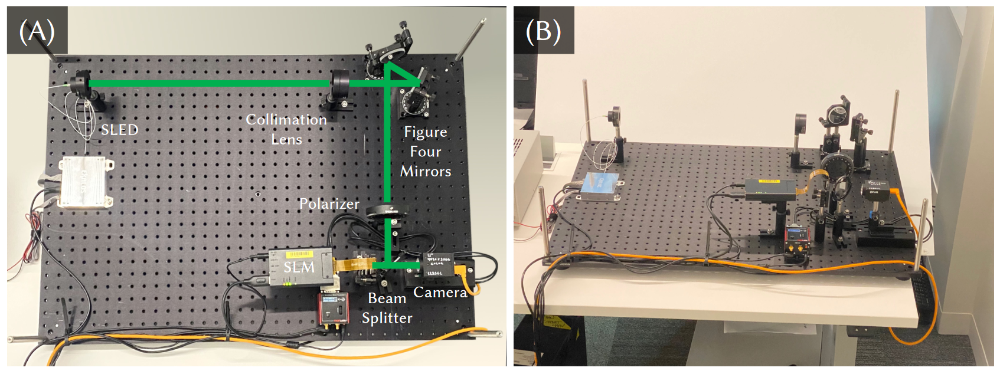

    Eric Markley, Nathan Matsuda, Florian Schiffers, Oliver Cossairt, Grace Kuo

<figure>
  
  <figcaption>
    
      <strong>Figure 5:</strong>
       <em>Focal Stack Results (Experiment)</em>:
    
  </figcaption>
</figure>

We propose a novel framework for simultaneous color holography that enables the use of a single spatial light modulator (SLM) pattern for generating red-green-blue (RGB) holograms. Our approach leverages a flexible optimization-based framework that incorporates a perceptual loss function, a physics-based neural network wavefront propagator, and a camera-calibrated forward model. By optimizing the SLM pattern for simultaneous RGB illumination, we eliminate the need for sequential color illumination, resulting in a 3× increase in frame rate and the complete removal of color fringing artifacts.

Our method addresses the challenges associated with simultaneous color holography, such as depth-color ambiguity and the presence of depth replicas. We take advantage of the extended phase range of the SLM to mitigate these issues and improve hologram quality. Additionally, our perceptual loss function prioritizes low-frequency color information, aligning with the human visual system's sensitivity to color, resulting in improved color fidelity and reduced noise in the generated holograms.

Through experimental validation, we demonstrate the effectiveness of our simultaneous color holography framework on both 2D and 3D content. Our compact and simple optical setup, combined with the elimination of sequential color illumination, brings us one step closer to realizing practical color holographic displays for augmented and virtual reality applications.

<figure>
  
  <figcaption>
    
      <strong>Figure 2:</strong>
    
  </figcaption>
</figure>

<figure>
  
  <figcaption>
    
      <strong>Figure 3:</strong>
 <em>Single Source vs. Multisource (Simulation):</em>
    
  </figcaption>
</figure>

<figure>
  
  <figcaption>
    
      <strong>Figure 4:</strong>
    
  </figcaption>
</figure>

