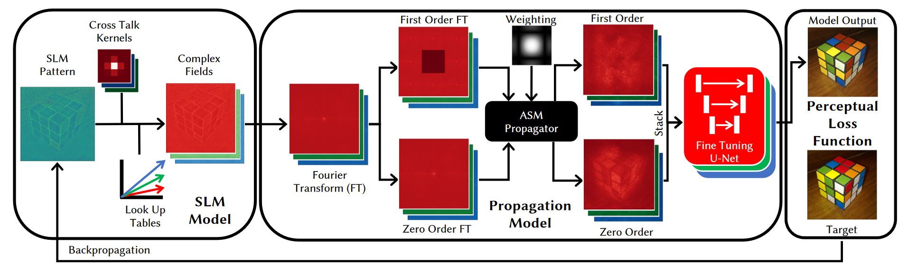

    Eric Markley, Nathan Matsuda, Florian Schiffers, Oliver Cossairt, Grace Kuo

<em>SIGGRAPH ASIA 2023</em>

<figure>
  
  <figcaption>
    
      <strong>Figure 1:</strong>
       <em>Simultaneous color holograms captured in experiment.</em>  Traditionally, color holograms are illuminated sequentially with a unique spatial light modulator (SLM) pattern for each color channel.  In this work we outline a flexible framework that enables the use of a single SLM pattern for red-green-blue (RGB) holograms using simultaneous RGB illumination.  We validate this framework experimentally on a simple and compact optical setup.
    
  </figcaption>
</figure>

<strong>Abstract:</strong> We propose a novel framework for simultaneous color holography that enables the use of a single spatial light modulator (SLM) pattern for generating red-green-blue (RGB) holograms. Our approach leverages a flexible optimization-based framework that incorporates a perceptual loss function, a physics-based neural network wavefront propagator, and a camera-calibrated forward model. By optimizing the SLM pattern for simultaneous RGB illumination, we eliminate the need for sequential color illumination, resulting in a 3× increase in frame rate and the complete removal of color fringing artifacts.

Our method addresses the challenges associated with simultaneous color holography, such as depth-color ambiguity and the presence of depth replicas. We take advantage of the extended phase range of the SLM to mitigate these issues and improve hologram quality. Additionally, our perceptual loss function prioritizes low-frequency color information, aligning with the human visual system's sensitivity to color, resulting in improved color fidelity and reduced noise in the generated holograms.

Through experimental validation, we demonstrate the effectiveness of our simultaneous color holography framework on both 2D and 3D content. Our compact and simple optical setup, combined with the elimination of sequential color illumination, brings us one step closer to realizing practical color holographic displays for augmented and virtual reality applications.

<!DOCTYPE html>
<html lang="en">
<head>
    <meta charset="UTF-8">
    <meta name="viewport" content="width=device-width, initial-scale=1.0">
    <title>Paper Display</title>
    
</head>
<body>

    <table>
        <tr>
            <td class="paper-image">
              <a href="paper.pdf">
                
            </td>
            <td class="text">
                
Simultaneous Color Computer Generated Holography

                

                    Eric Markley, Nathan Matsuda, Florian Schiffers, Oliver Cossairt, Grace  
                

                

                    SIGGRAPH ASIA 2023
                

                

                    <a href="paper.pdf">Paper</a>
                    <a href="supplement.pdf">Supplement</a>
                    <!-- <a href="#">Bibtex</a>
                    <a href="#">Code (soon)</a> -->
                

            </td>
        </tr>
    </table>

</body>
</html>

<figure>
  
  <figcaption>
    
      <strong>Figure 2:</strong>
      <em>Comparison of bit division, depth division and our method of simultaneous color holography in simulation.</em>
    Bit division (Col. 1) is noisier than our method (Col. 3) but achieves comparable color fidelity, although more washed out.  The depth division method (Col. 2) is also noisier than our method and has inferior color fidelity.  Our method matches the target  image (Col. 4) well.  Our method uses our perceptual loss function and a high order angular spectrum propagation model with no learned components. Further implementation details for each method are available in the supplement.
    
  </figcaption>
</figure>

<figure>
  
  <figcaption>
    
      <strong>Figure 3:</strong>
    <em>Hologram optimization framework.</em>
    This figure illustrates the three key components of the simultaneous color optimization framework: an SLM model, a propagation model, and a perceptual loss function. The SLM model maps voltage values to a complex field using a learned cross-talk kernel and a linear lookup table. The complex wavefront from the SLM is then propagated to the sensor plane using a modified version of the model proposed by, which separates the zeroth and first diffraction orders and combines them through a U-Net. The output is then fed into the perceptual loss function, and gradients are calculated using PyTorch's autograd implementation. The SLM voltages are then updated using these gradients. Rubik's cube source image by Iwan Gabovitch (CC BY 2.0).
    
  </figcaption>
</figure>

<figure>
  
  <figcaption>
    
      <strong>Figure 4:</strong>
    <em>Experimental setup</em>: A top view of our system with labeled components and an approximate beam path drawn in green is depicted in (A).  A side-view of the system is provided by (B). Note that the hologram is formed directly on the bare camera sensor with no lens or eyepiece between. This configuration allows us to validate our method, but for a human-viewable system, an eyepiece must be added between the hologram plane and the user's eye.
    
  </figcaption>
</figure>

