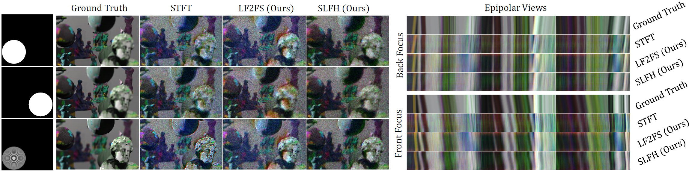
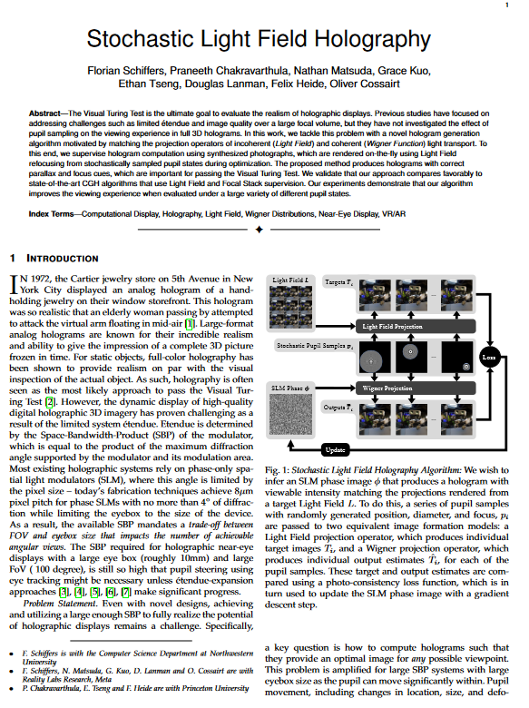
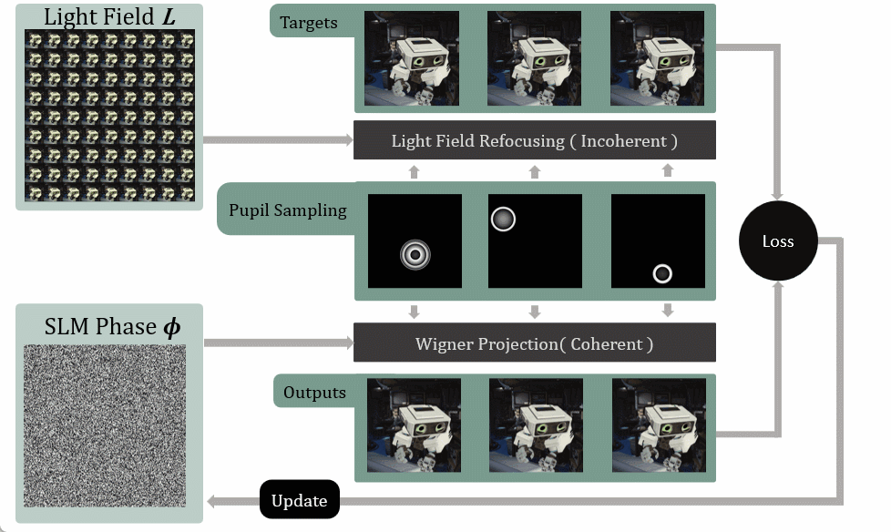
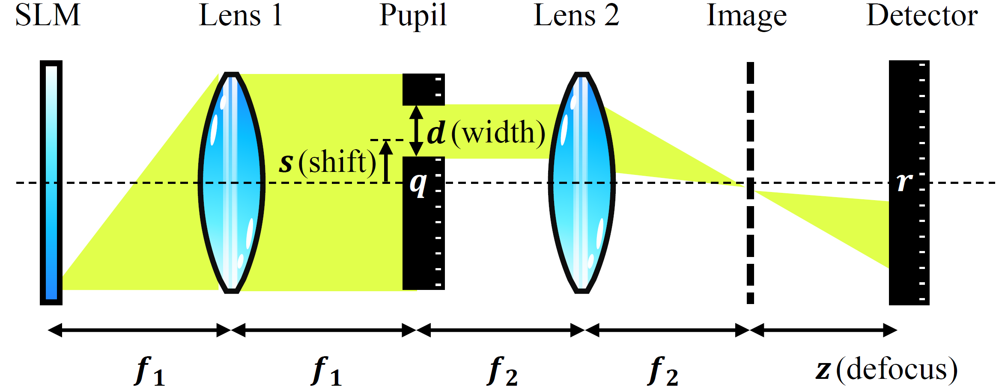

   Florian Schiffers, Praneeth Chakravarthula, Nathan Matsuda, Grace Kuo, Ethan Tseng, Doug Lanman, Felix Heide, Oliver Cossairt

<em>ICCP 2023</em>

<figure>
  
  <figcaption>
    
      <strong>Figure 1:</strong> <em>Stochastic Light Field Holography on Experimental Hardware.</em> Recent advances in holographic displays achieve high image fidelity using smooth-phase holograms. This comes at the cost of a highly concentrated eye box limiting image formation to only the central view. For a more robust visual experience, holographic displays should provide good image quality for arbitrary pupil-states (diameter, location, and accommodation) within the entire available eye box. By definition requires a random-phase hologram. With Stochastic Light Field Holography (SLFH), we propose a novel framework that ensures photo-consistency over the entire eye-box volume. We implement a novel Focal Stack supervision algorithm (LF2FS) and show that SLFH is a generalization of state-of-the-art (SOTA) (Focal Stack and Short-Time-Fourier-Transform (STFT)) supervision of CGH optimization algorithms, representing only a limited subset of possible pupil states. Consequently, our proposed method provides the best average image fidelity over the entire eyebox compared to SOTA. On the left, we show experimental captures from three example pupil states (Front/Back focus for accommodation, left/right for parallax). On the right, we show epipolar slices generated by capturing a 1D trajectory consisting of 31 small pupils (1/8th of eyebox) from left to right for both front and back focus. Our SLFH method produces the least artifacts over the full eyebox, while Focal Stack supervision produces strong color-fringing at occlusions and STFT-optimized holograms often show ringing artifacts and over-sharpened in focus images.
    
  </figcaption>
</figure>

<strong>Abstract:</strong> The Visual Turing Test is the ultimate goal to evaluate the realism of holographic displays. Previous studies have focused on addressing challenges such as limited étendue and image quality over a large focal volume, but they have not investigated the effect of pupil sampling on the viewing experience in full 3D holograms. In this work, we tackle this problem with a novel hologram generation algorithm motivated by matching the projection operators of incoherent (Light Field) and coherent (Wigner Function) light transport. To this end, we supervise hologram computation using synthesized photographs, which are rendered on-the-fly using Light Field refocusing from stochastically sampled pupil states during optimization. The proposed method produces holograms with correct parallax and focus cues, which are important for passing the Visual Turing Test. We validate that our approach compares favorably to state-of-the-art CGH algorithms that use Light Field and Focal Stack supervision. Our experiments demonstrate that our algorithm improves the viewing experience when evaluated under a large variety of different pupil states.

<!DOCTYPE html>
<html lang="en">
<head>
    <meta charset="UTF-8">
    <meta name="viewport" content="width=device-width, initial-scale=1.0">
    <title>Paper Display</title>
    
</head>
<body>

    <table>
        <tr>
            <td class="paper-image">
              <a href="destination_url_here">
                
            </td>
            <td class="text">
                
Stochastic Light Field Holography

                

                    Florian Schiffers, Praneeth Chakravarthula, Nathan Matsuda, Grace Kuo, Ethan Tseng, Douglas Lanman, Felix Heide, Oliver Cossairt
                

                

                    ICCP 2023
                

                

                    <a href="paper.pdf">Paper</a>
                    <a href="stochastic_light_field_holography_supp.pdf">Supplement</a>
                    <!-- <a href="#">Bibtex</a>
                    <a href="#">Code (soon)</a> -->
                

            </td>
        </tr>
    </table>

</body>
</html>

<table>
  <tr>
    <td class="text">
      <a href="../project/holography/" style="text-decoration: none; color: inherit;">
        <strong>Fig. 2</strong>
        <em>Stochastic Light Field Holography Algorithm</em>
         
         We wish to infer an SLM phase image φ that produces a hologram with viewable intensity matching the projections rendered from a target Light Field L. To do this, a series of pupil samples with randomly generated position, diameter, and focus, pi are passed to two equivalent image formation models: a Light Field projection operator, which produces individual target images 𝑇𝑖, and a Wigner projection operator, which produces individual output estimates 𝑇̂𝑖 for each of the pupil samples. These target and output estimates are compared using a photo-consistency loss function, which is in turn used to update the SLM phase image with a gradient descent step.
      </a>
    </td>
      <td class="image">
        
    </td>
  </tr>
</table>

<table>
  <tr>
    <td class="image">
        
    </td>
    <td class="text">
      <a href="../project/holography/" style="text-decoration: none; color: inherit;">
        <strong>Fig. 2</strong>
        <em>Stochastic Light Field Holography Algorithm</em>
         
Simplified Diagram of the Proposed Setup: An SLM (illumination path not shown) diffracts a collimated beam according to an optimized pattern. The modulated beam passes through a 4-f system, with a pupil having programmable shift s and diameter d. The relay system produces an image of the SLM offset from the detector by a defocus distance z.
      </a>
    </td>
  </tr>
</table>

<strong>Experimental Results from Benchtop Prototype:</strong>
The figures below presents a visual comparison of holograms generated with the two comparison methods and our proposed approach. Each hologram consists of eight temporal multiplexed SLM-patterns per color channel (i.e., 24 independent SLM-patterns per image ).
Though subtle, the differences can be discerned between the results obtained from STFT and Focal Stack, which exhibit slight defocus artifacts and color fringing artifacts. These artifacts are not present in the results obtained from our proposed method.
We see further potential for improvement in image quality with the application of a Neural-holography style calibration to reduce systematic error due to misalignment and modeling of other physical effects such as field-fringing.

<table>
  <tr>
    <td class="text">
      <a href="../project/holography/" style="text-decoration: none; color: inherit;">
        <strong>Fig. 2</strong>
        <!-- <em>Stochastic Light Field Holography Algorithm</em>
          -->
Experimental results (Deep Focus dataset): For each hologram, we sample the eyebox with a small pupil that is moved from left to right. We further evaluated it with a front and back focus. Our results demonstrate the existence of correct parallax and defocus cues when moving a small pupil around for each of the comparison methods.
      </a>
    </td>
      <td class="image">
        
    </td>
  </tr>
</table>

<table>
  <tr>
    <td class="image">
        
    </td>
    <td class="text">
      <a href="../project/holography/" style="text-decoration: none; color: inherit;">
        <strong>Fig. 2</strong>
        <!-- <em>Stochastic Light Field Holography Algorithm</em> -->
        <!--   -->
Experimental Results (Tnux Robot sene): For each hologram, we sample the eyebox with a small pupil that is moved from left to right. Our results demonstrate the existence of correct parallax and defocus cues when moving a small pupil around for each of the comparison methods. Overall, our proposed method shows the best image fidelity over the complete eyebox.
      </a>
    </td>
  </tr>
</table>

<h3 style="font-size: 1.5em; margin-bottom: 0.5em;">Related Work</h3>

    <strong>Chakravarthula, Praneeth, et al.</strong> 
    <em>Pupil-aware Holography.</em> ACM Transactions on Graphics (TOG), 2022.

    <strong>Shi, Liang, Donghun Ryu, and Wojciech Matusik.</strong> 
    <em>Ergonomic-Centric Holography: Optimizing Realism, Immersion, and Comfort for Holographic Display.</em> arXiv preprint arXiv:2306.08138, 2023.

    <strong>Monin, Sagi, Aswin C. Sankaranarayanan, and Anat Levin.</strong> 
    <em>Analyzing phase masks for wide étendue holographic displays.</em> 2022 IEEE International Conference on Computational Photography (ICCP), IEEE, 2022.

