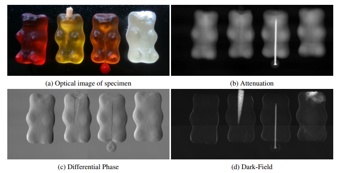
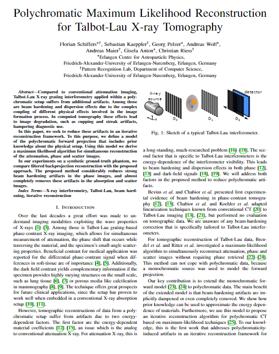

<figure>

<figcaption>

<strong>Figure 1</strong>: Example images to demonstrate Grating Based X-Ray interferometry and the different information it provides. The specimen is made of 4 gummy bears. The first (red) was imaged without any preparation. The second (yellow) has a splinter of wood inserted on its top. The third (red) one contains pin made of metal and a plastic head. The last (white) is filled with small PMMA-beads on its top with a diameter of 6µm.

</figcaption>

<!DOCTYPE html>
<html lang="en">
<head>
    <meta charset="UTF-8">
    <meta name="viewport" content="width=device-width, initial-scale=1.0">
    <title>Paper Display</title>
    
</head>
<body>

    <table>
        <tr>
            <td class="paper-image">
              <a href="paper.pdf">
                
            </td>
            <td class="text">
                

Polychromatic Maximum Likelihood Reconstruction for Talbot-Lau X-ray Tomography

                

                     Schiffers, Florian, Sebastian Kaeppler, Georg Pelzer, Andreas Wolf, Andreas Maier, Gisela Anton, and Christian Riess
                

                

                    Fully3D 2017
                

                

                    <a href="FlorianSchiffers_Fully3D2017.pdf">Paper</a>
                    <a href="FlorianSchiffers_Masterthesis_2017.pdf">Master Thesis</a>
                    <a href="Project_Report_Tensor_Tomography.pdf">Keystone Project</a>
                    <a href="FlorianSchiffers_fully3d_presentation.pdf">Fully3D Slides</a>
                    <a href="master_thesis_presentation.pdf">Thesis Presentation Slides</a>
                    <!-- <a href="#">Bibtex</a>
                    <a href="#">Code (soon)</a> -->
                

            </td>
        </tr>
    </table>

</body>
</html>
 

Talbot-Lau X-ray grating interferometry applied within a polychromatic setup suffers from additional artifacts compared to conventional attenuation imaging. Among those are beam hardening and dispersion effects due to the complex coupling of different physical effects involved in the image formation process. In computed tomography these effects lead to image degradation, such as cupping and streak artifacts, hampering diagnostic use. 

This thesis seeks to reduce these artifacts in an iterative reconstruction framework. To this purpose, we define a model of the polychromatic forward projection that includes prior knowledge about the physical setup. Using this model we derive a maximum likelihood algorithm for simultaneous reconstruction of the attenuation, phase and scatter images. 

In our experiments on a synthetic ground-truth phantom, we compare filtered back projection reconstruction with the proposed approach. The proposed method considerably reduces strong beam hardening artifacts in the phase images, and almost completely removes these artifacts in the absorption and scatter images. Reconstruction with real data has not been successful because the proposed model does not reproduce the measured reality. Further research is required to resolve this discrepancy.

Furthermore, an optimized iterative reconstruction algorithm for grating based tomography is proposed. Last, an in-depth analysis of an iterative reconstruction framework for Talbot-Lau imaging data is provided.

<object data="IMXP_Poster.pdf" type="application/pdf" width="700px" height="900px">
    <embed src="IMXP_Poster.pdf">
        
This browser does not support PDFs. Please download the PDF to view it: <a href="IMXP_Poster.pdf">Download PDF</a>.

    </embed>
</object>