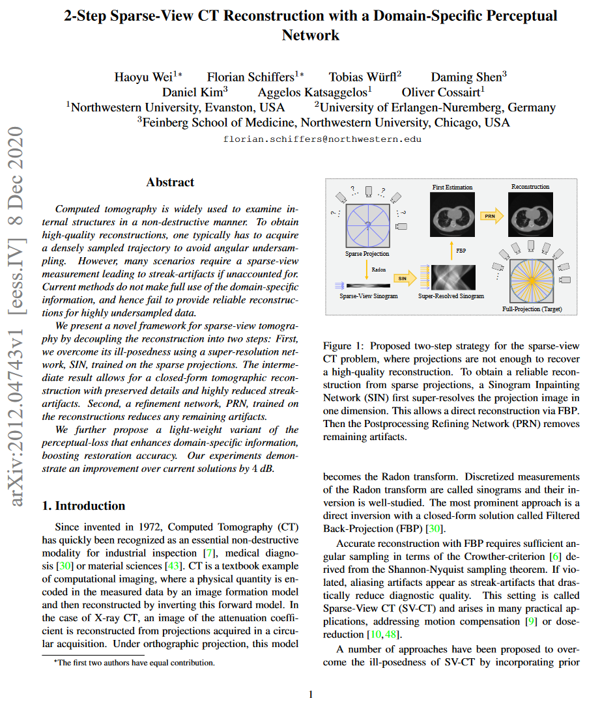

   Florian Schiffers*, Haoyu Wei*, Tobias Würfl, and D. Shen, D. Kim, AK Katsaggelos, Oliver Cossairt 

<figure>
  
  <figcaption>
    
      <strong>Figure 1:</strong> We propose a new architecture for holographic displays specifically designed for speckle reduction. Instead of a single coherent source of illumination, our design uses a grid of multiple sources, which sum incoherently at the image plane. By using two spatial light modulators (SLMs) with an air gap in between, we break correlations between the multiple sources enabling high-resolution holograms with significantly suppressed speckle. We experimentally demonstrate speckle reduction on both 2D images (left) and focal stacks with natural defocus blur (right).
    
  </figcaption>
</figure>

<!DOCTYPE html>
<html lang="en">
<head>
    <meta charset="UTF-8">
    <meta name="viewport" content="width=device-width, initial-scale=1.0">
    <title>Paper Display</title>
    
</head>
<body>

    <table>
        <tr>
            <td class="paper-image">
              <a href="paper.pdf">
                
            </td>
            <td class="text">
                

2-Step Sparse-View CT Reconstruction with a Domain-Specific Perceptual Network

                

                     Florian Schiffers*, Haoyu Wei*, Tobias Würfl, and D. Shen, D. Kim, AK Katsaggelos, Oliver Cossairt 
                

                

                    ICCP 2023
                

                

                    <a href="paper.pdf">Paper</a>
                    <a href="supplement.pdf">Supplement</a>
                    <!-- <a href="#">Bibtex</a>
                    <a href="#">Code (soon)</a> -->
                

            </td>
        </tr>
    </table>

</body>
</html>
 

### Introduction
We tackle the challenges in sparse-view Computed Tomography (CT) reconstruction, introducing a groundbreaking framework that enhances the quality of reconstructions from undersampled data. This work focuses on a novel two-step reconstruction approach and a domain-specific perceptual network to address the limitations of existing methods in sparse-view tomography.

### Method
#### Innovative Two-Step Approach
Our method employs a Sinogram Inpainting Network (SIN) in the first step, generating super-resolved sinograms and allowing for object reconstruction without severe streak artifacts. The second step utilizes a Postprocessing Refining Network (PRN) to refine the reconstruction by removing any remaining localized artifacts, ensuring high-quality results.

#### Discriminator Perceptual Network
We introduce a Discriminator Perceptual (DP) loss, interpreting the initial layers of a discriminator as a feature extractor. This novel approach is trained simultaneously with the generator, promoting feature-level similarity and enhancing stability in our GAN training procedure.

### Results and Discussion
Our approach demonstrates substantial improvement, achieving over 4 dB PSNR in reconstruction accuracy and effectively handling high compression ratios. The innovative domain-specific perceptual loss outperforms traditional methods in accuracy, efficiency, and memory usage.

### Conclusion
This work presents a pioneering approach for enhancing sparse-view CT reconstruction, combining a two-step method and a domain-specific perceptual network. The introduced Discriminator Perceptual loss offers a stable and efficient solution, significantly advancing the field of sparse-view CT reconstruction.

For more details and to access the code, see [the paper](https://arxiv.org/pdf/2012.04743.pdf) and visit [GitHub](https://github.com/anonyr7/Sinogram-Inpainting).

<figure>
  
  <figcaption>
    
      <strong>Figure 1:</strong>
    
  </figcaption>
</figure>

<figure>
  
  <figcaption>
    
      <strong>Figure 1:</strong>
    
  </figcaption>
</figure>

<figure>
  
  <figcaption>
    
      <strong>Figure 1:</strong>
    
  </figcaption>
</figure>

<figure>
  
  <figcaption>
    
      <strong>Figure 1:</strong>
    
  </figcaption>
</figure>

<figure>
  
  <figcaption>
    
      <strong>Figure 1:</strong>
    
  </figcaption>
</figure>