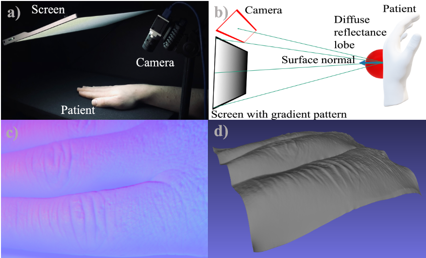
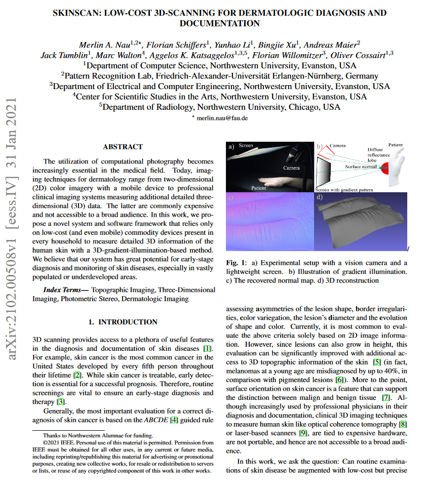
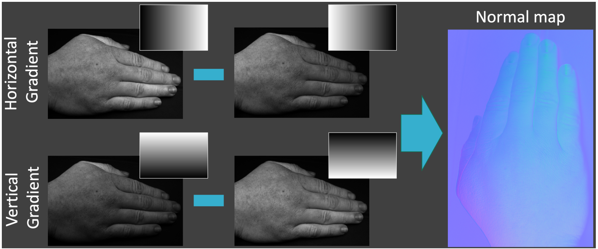
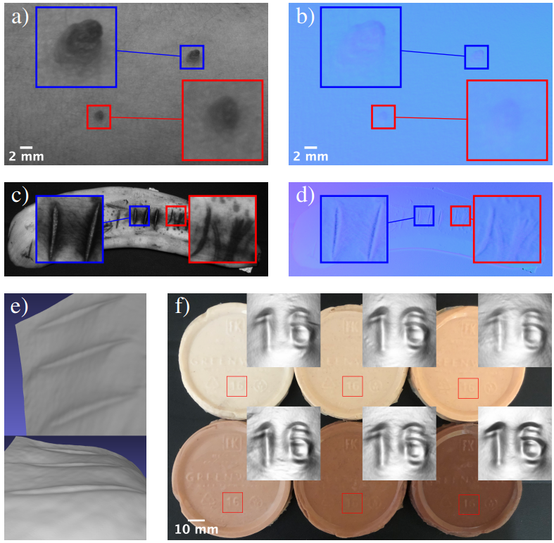

   Merlin A Nau, Florian Schiffers, Yunhao Li, Bingjie Xu, Andreas Maier, Jack Tumblin, Marc Walton, Aggelos K Katsaggelos, Florian Willomitzer, Oliver Cossairt

<em>ICIP 2021</em>

<figure>
  
  <figcaption>
    
      <strong>Figure 1:</strong> We propose a new architecture for holographic displays specifically designed for speckle reduction. Instead of a single coherent source of illumination, our design uses a grid of multiple sources, which sum incoherently at the image plane. By using two spatial light modulators (SLMs) with an air gap in between, we break correlations between the multiple sources enabling high-resolution holograms with significantly suppressed speckle. We experimentally demonstrate speckle reduction on both 2D images (left) and focal stacks with natural defocus blur (right).
    
  </figcaption>
</figure>

<!DOCTYPE html>
<html lang="en">
<head>
    <meta charset="UTF-8">
    <meta name="viewport" content="width=device-width, initial-scale=1.0">
    <title>Paper Display</title>
    
</head>
<body>

    <table>
        <tr>
            <td class="paper-image">
              <a href="paper.pdf">
                
            </td>
            <td class="text">
                
Skinscan - Low-cost 3d-scanning for dermatologic diagnosis and documentation

                

                    Merlin A Nau, Florian Schiffers, Yunhao Li, Bingjie Xu, Andreas Maier, Jack Tumblin, Marc Walton, Aggelos K Katsaggelos, Florian Willomitzer, Oliver Cossairt 
                

                

                    ICIP 2021
                

                

                    <a href="paper.pdf">Paper</a>
                    <!-- <a href="supplement.pdf">Supplement</a> -->
                    <!-- <a href="#">Bibtex</a>
                    <a href="#">Code (soon)</a> -->
                

            </td>
        </tr>
    </table>

</body>
</html>
 

<figure>
  
  <figcaption>
    
      <strong>Figure 1:</strong>
    
  </figcaption>
</figure>

<figure>
  
  <figcaption>
    
      <strong>Figure 3:</strong>
    
  </figcaption>
</figure>

### Introduction
In this work, we explore the application of computational photography in the medical field, with a focus on dermatology. We propose a novel system and software framework that utilizes readily available, low-cost devices to acquire detailed 3D information of human skin using a 3D-gradient-illumination-based method. We believe this system holds substantial potential for the early-stage diagnosis and monitoring of skin diseases, particularly in densely populated or underdeveloped areas.

### Method
We employ mobile gradient illumination to develop an economical measurement system for dermatological evaluation of skin. The system necessitates a programmable screen and a camera and can be implemented with a single mobile device, such as a smartphone or tablet. Additionally, we have developed an open-source software framework. This framework is object-oriented and includes base classes for essential components like the camera, projector, image reconstruction, and calibration class. It is implemented in Python and is compatible with various operating systems.

### Results
We demonstrated the efficacy of our method through reconstructed surface normal maps from different objects, including human skin and a banana peel. The method was successful in capturing accurate 3D representations of the skin's folds and wrinkles, with the results being highly repeatable and independent of environmental factors. The method was able to discern between different surface orientations and depths, even in areas with color variations, showcasing its potential in the assessment and monitoring of skin diseases.

### Conclusion
In conclusion, we have introduced a method that is low-cost, mobile, and effective for 3D imaging using gradient illumination for dermatological imaging. It is versatile and user-friendly, with the open-source framework providing the necessary software programming for each component required by the method. While the primary focus has been on dermatological applications, the potential uses of this method are broad and could include applications in digital cultural heritage.

Should you have any more inquiries or need further clarification on any point, feel free to ask!

### Software

[SkinScan:](https://github.com/merlzbert/SkinScan) An open-source framework for structured light 3D imaging, which includes the possibility to perform Deflectometry and Photometric Stereo measurements at home using solely commodity devices.