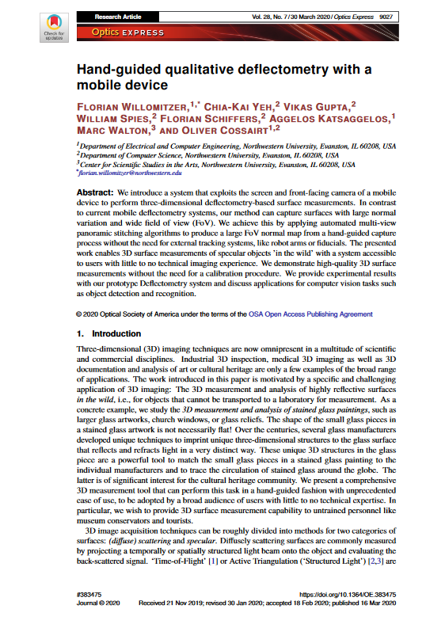

Florian Willomitzer, Chia-Kai Yeh, Vikas Gupta, William Spies, Florian Schiffers, Aggelos Katsaggelos, Marc Walton, Oliver Cossairt

<em>Optics Express 2020</em>

<!DOCTYPE html>
<html lang="en">
<head>
    <meta charset="UTF-8">
    <meta name="viewport" content="width=device-width, initial-scale=1.0">
    <title>Paper Display</title>
    
</head>
<body>

    <table>
        <tr>
            <td class="paper-image">
              <a href="paper.pdf">
                
            </td>
            <td class="text">
                
Multisource Holography

                

                    Grace Kuo, Florian Schiffers, Douglas Lanman, Oliver Cossairt, Nathan Matsuda
                

                

                    ICCP 2023
                

                

                    <a href="paper.pdf">Paper</a>
                    <!-- <a href="supplement.pdf">Supplement</a> -->
                    <!-- <a href="#">Bibtex</a>
                    <a href="#">Code (soon)</a> -->
                

            </td>
        </tr>
    </table>

</body>
</html>
 

3D imaging methods accessible to a broad audience

This body of work introduces a series of systems that only require commodity devices such as screens, (web-) cameras, low-end tablets or mobile phones to capture high-quality 3D data: The developed “Mobile Multiview Deflectometry” system exploits screen and front camera of mobile devices for deflectometry-based measurements. It works without the need for a calibration and is optimized for specular surfaces such as stained glass artworks. To compensate for the small screen, a multi-view registration technique is applied so that large surfaces can be densely reconstructed in their entirety. The “SkinScan” sensor principle uses the same hardware components but exploits photometric stereo algorithms for the measurement of matte object surfaces such as human skin.

Applications: The project is a first step towards a universal self-calibrating measurement procedure usable by a broad audience with little to no technical imaging experience. The introduced sensor principles have great potential for cultural heritage analysis and for telemedicine or medical treatment/diagnosis in developing countries.

Jump to: [Related Talk Recording] , [Publications] , [Software] , [News and Press]
