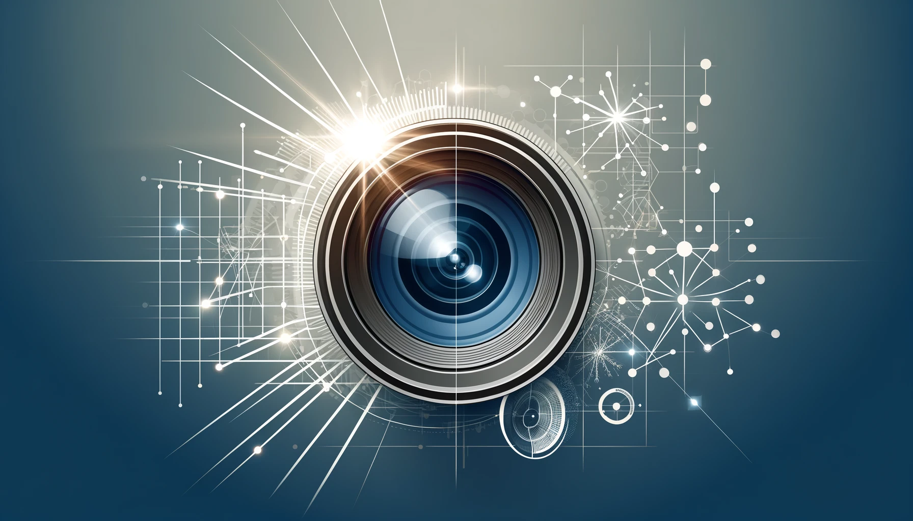

# [Computer Generated Holography](../project/holography)
With Computer Generated Holography, we delve into creating high-resolution, realistic holographic images and displays. These projects focus on developing advanced algorithms and techniques to enhance the quality and realism of holographic displays, pushing the boundaries of visual representation and interaction.

# [Medical Imaging](../project/medical_imaging)
Here we work on innovative solutions and methodologies to improve diagnostic accuracy and visualization of internal body structures. These projects aim to leverage cutting-edge computational methods to advance medical diagnostics, image reconstruction and explainable AI.

# [Tomography](../project/tomography)
Explore our work in Computed Tomography, focusing on developing advanced reconstruction techniques and methodologies for analyzing cross-sectional views of objects. Our projects in this category aim to enhance the quality and precision of tomographic images, enabling detailed insights into the internal structures and properties of studied objects, e.g. with biological applications.

# [Other Projects](../project/otherprojects)
Discover a variety of innovative endeavors in that didn't fit into categories above. All our projects are related to Computational Imaging, Photography and Machine Learning.

# [Undergraduate Research](../project/undergraduate)
Here I showcase research that I've performed during my bachelor and master studies in Germany. These projects reflect my early passion and dedication to scientific inquiry and innovation, spanning various disciplines and research areas.