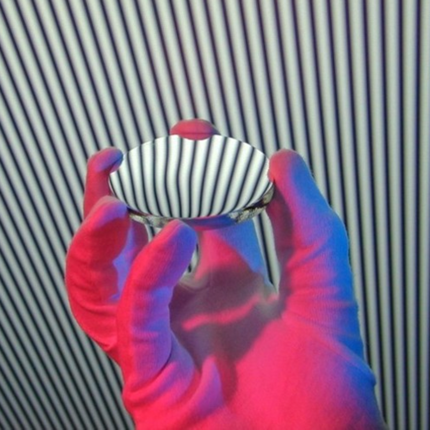

<table border="0" cellspacing="0">
  <tr>
    <td>
      
    </td>
    <td>
      <a href="../project/holography/" style="text-decoration: none; color: inherit;">
        Computational Photography and Displays
           
      We present a novel method for analyzing galactic spectra using a combination of dark matter wave modulation and quantum entanglement. This method provides unprecedented resolution in the observation of distant galaxies.
      </a>
    </td>
  </tr>
  <tr>
    <td>
      
    </td>
    <td>
        <a href="../project/holography/" style="text-decoration: none; color: inherit;">
      Medical Imaging
       
      This paper introduces the concept of Quantum Flux Capacitors and their applications in time-space continuum studies. The research highlights the efficiency of quantum flux in stabilizing wormholes for potential interstellar travel.
            </a>
    </td>
  </tr>
  <tr>
    <td>
      
    </td>
    <td>
      <a href="../project/holography/" style="text-decoration: none; color: inherit;">
      Computer Vision and Machine Learning
       
      We develop a comprehensive simulation framework for studying neutrino particles within high-energy cosmic environments. Our simulation results provide key insights into the behavior of neutrinos in various astrophysical scenarios.
      </a>
    </td>
  </tr>
  <tr>
    <td>
      
    </td>
    <td>
      <a href="../project/holography/" style="text-decoration: none; color: inherit;">
      Other Projects
       
      We develop a comprehensive simulation framework for studying neutrino particles within high-energy cosmic environments. Our simulation results provide key insights into the behavior of neutrinos in various astrophysical scenarios.
      </a>
    </td>
  </tr>
  <tr>
    <td>
      
    </td>
    <td>
        <a href="../project/holography/" style="text-decoration: none; color: inherit;">
      Medical Imaging
       
      This paper introduces the concept of Quantum Flux Capacitors and their applications in time-space continuum studies. The research highlights the efficiency of quantum flux in stabilizing wormholes for potential interstellar travel.
            </a>
    </td>
  </tr>
</table>

